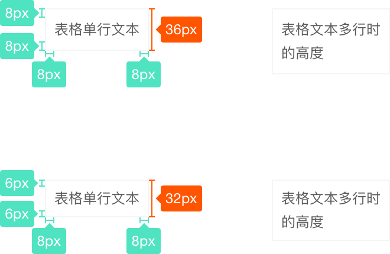

# Table 表格

用于展示多条结构类似的数据，可对数据进行排序、编辑、筛选、等其他自定义操作。

## ▼ 基础

####文字
> 
1、字号为12px
 
2、行高为20px

####内边距
> 
1、左右边距8px
 
2、上下边距分两种：6px和8px。上下边距结合行高会有两种表格行高度尺寸。

####行高度
上下边距结合行高会有两种表格行高度尺寸，注意：表格最多显示两行。
> 
单行高度
 
1、当上下边距为8px时，高度为36px（多用于独立面板）
 
2、当上下边距为6px时，高度为32px（多用于右面板）

> 
两行高度
 
1、当上下边距为8px时，高度为56px（多用于独立面板）
 
2、当上下边距为6px时，高度为52px（多用于右面板）

####边框线
> 
1、粗细：1px
 
2、颜色：rgba(0,0,0,0.04)

##**[UI预览](http://www.163.com)**